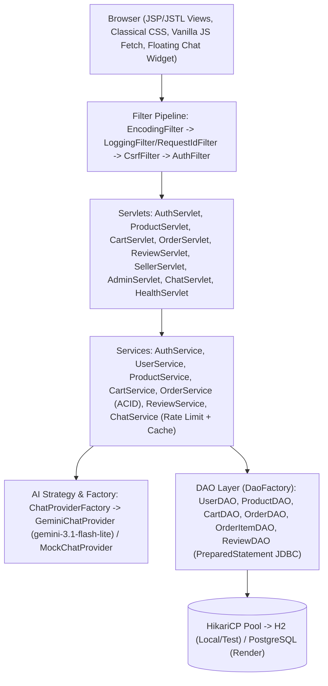

# MohanMart — Multi-Seller E-Commerce Marketplace

**Anna University R2025 Semester 3 JAVA Capstone Project**  
*Package: `com.mohan.mohanmart` · Java 17 LTS · Servlets 4.0 / JSP 2.3 / JSTL 1.2 · Apache Tomcat 9.0.x · Raw JDBC + HikariCP · H2 & PostgreSQL · Gemini 3.1 Flash Lite AI Chatbot*

- **Live Deployment URL**: `<LIVE_URL>` *(Configure on Render via `Dockerfile`)*
- **Health Check Endpoint**: `<LIVE_URL>/api/v1/health` (`GET` → `{"status":"UP","db":"UP"}`)

---

## 1. Problem Statement & Project Overview

**MohanMart** is a production-grade, multi-seller e-commerce marketplace built strictly with core Java EE 8 / Servlet 4.0 fundamentals (no Spring, no Hibernate/JPA, no heavy frontend frameworks). Independent artisans and sellers can publish and manage product listings, buyers can browse, search, filter, manage server-side carts, execute atomic ACID checkouts via a simulated escrow payment gateway, track order statuses (`PENDING → CONFIRMED → SHIPPED → DELIVERED`), and submit verified product reviews, while administrators govern accounts, listings, and platform orders.

In addition, **MohanMart** includes an integrated, privacy-preserving **AI Marketplace Assistant Chatbot (O4)** powered by `ChatProviderFactory` (`GeminiChatProvider` using `gemini-3.1-flash-lite` with an 8-second timeout, PII redaction, and automatic failover to `MockChatProvider`).

---

## 2. Technology Stack

| Layer / Component | Technology & Version | Purpose |
| :--- | :--- | :--- |
| **Language & Runtime** | Java 17 LTS | Core language, `java.net.http.HttpClient`, records/streams |
| **Servlet Container** | Apache Tomcat 9.0.x | Java EE 8 Servlet 4.0 (`javax.servlet.*`), JSP 2.3, JSTL 1.2 |
| **Build & Quality** | Apache Maven 3.9+ | WAR packaging, Surefire 3.2.5, Checkstyle, SpotBugs |
| **Database** | H2 2.2.x (local/test) & PostgreSQL 42.7.2 (Render) | Relational persistence with versioned SQL migrations (`V1`–`V4`) |
| **Connection Pool** | HikariCP 5.1.0 | Single pool managed by `AppContextListener` |
| **JSON Serialization** | Google Gson 2.10.1 | REST `/api/v1/...` request/response serialization |
| **Security** | jBCrypt 0.4 + Custom Filters | Salted BCrypt (cost 12), `AuthFilter` RBAC, `CsrfFilter`, `<c:out>` XSS defense |
| **AI Assistant (O4)** | `GeminiChatProvider` / `MockChatProvider` | `gemini-3.1-flash-lite` via REST + 10 msg/min session rate limiter & cache |
| **Logging & Tracing** | SLF4J 2.0.12 + Logback 1.5.3 | Structured logging with `RequestIdFilter` UUID in MDC (`%X{requestId}`) |
| **Testing** | JUnit 5 Jupiter 5.10.2 + Mockito 5.11.0 | 180 unit, DAO, service, controller, filter, and embedded Tomcat E2E tests |
| **CI / CD** | GitHub Actions + Docker | Automated `mvn -B clean verify`, static analysis, WAR artifact, and Render `Dockerfile` |

---

## 3. System Architecture & Diagrams

- **[D1: Entity-Relationship Diagram (ERD)](docs/diagrams/D1_er_diagram.md)**
- **[D2: Use Case Diagram (Buyer, Seller, Admin & AI Chatbot)](docs/diagrams/D2_use_case_diagram.md)**
- **[D3: Place Order Transactional Sequence Diagram](docs/diagrams/D3_sequence_place_order.md)**
- **[D4: Layered Architecture Diagram](docs/diagrams/D4_architecture_diagram.md)**



---

## 4. Environment Variables & Configuration

Copy `.env.example` to `.env` or `src/main/resources/config.properties.example` to `src/main/resources/config.properties` (both `.env` and `config.properties` are gitignored):

| Variable / Property | Default | Description |
| :--- | :--- | :--- |
| `JDBC_URL` / `DATABASE_URL` | `jdbc:h2:mem:mohanmart;DB_CLOSE_DELAY=-1;MODE=PostgreSQL` | H2 local JDBC URL or Render PostgreSQL `DATABASE_URL` |
| `JDBC_USER` (`db.user`) | `sa` | Database username |
| `JDBC_PASSWORD` (`db.password`) | *(empty)* | Database password |
| `AI_CHATBOT_PROVIDER` (`ai.chatbot.provider`) | `mock` | `mock` (offline deterministic FAQ + catalog) or `gemini` |
| `GEMINI_API_KEY` | *(unset)* | Google Gemini API key (server-side only; falls back to `mock` if unset) |
| `GEMINI_MODEL` (`ai.chatbot.model`) | `gemini-3.1-flash-lite` | Gemini model identifier (`gemini-2.5-*` is blocked) |
| `ADMIN_PASSWORD` | *(configured in local `.env` / `seed.sql`)* | Initial seeded administrator password |

---

## 5. Local Setup (H2) & Cloud Deployment (Render / PostgreSQL)

### Local Setup & Verification
```bash
# 1. Clone repository
git clone https://github.com/mohanraj2707/MohanMart.git
cd MohanMart

# 2. Configure local properties (optional - defaults to embedded H2)
cp src/main/resources/config.properties.example src/main/resources/config.properties

# 3. Run full build, migrations, and all 180 automated JUnit 5 tests
mvn -B clean verify

# 4. Run static analysis (Checkstyle & SpotBugs)
mvn -B checkstyle:check spotbugs:check
```

### Deploying to Render (Docker + PostgreSQL)
1. Push repository to GitHub (`main` branch).
2. In Render, create a new **Web Service** connected to the repo using the root `Dockerfile`.
3. Set environment variables in Render Dashboard:
   - `DATABASE_URL` (or `JDBC_URL`, `JDBC_USER`, `JDBC_PASSWORD`) from your Render PostgreSQL instance (or leave unset to run H2).
   - `AI_CHATBOT_PROVIDER=gemini` (or `mock`)
   - `GEMINI_API_KEY=<your-key>`
   - `GEMINI_MODEL=gemini-3.1-flash-lite`
4. Verify live health check at `<LIVE_URL>/api/v1/health`.

---

## 6. Demo Accounts (Seeded for Development)

Passwords are hashed with BCrypt (cost 12) in `db/seed.sql` and configured via local environment/seed settings (never hardcode production credentials):

| Role | Email | Password Source | Capabilities |
| :--- | :--- | :--- | :--- |
| **ADMIN** | `admin@mohanmart.com` | Configured via `ADMIN_PASSWORD` / local seed | Platform metrics, user governance, catalog & order moderation |
| **SELLER** | `seller1@mohanmart.com` | Local development seed account | Seller Hub KPIs, product CRUD, order fulfillment (`CONFIRMED → SHIPPED → DELIVERED`) |
| **BUYER** | `buyer1@mohanmart.com` | Local development seed account | Browse/search, cart, atomic checkout, order tracking, verified reviews, AI chat |

---

## 7. Screenshots & Documentation Links

### Screenshots (`docs/screenshots/`)
- `docs/screenshots/01-marketplace-home.png` — Landing page & curated categories *(placeholder)*
- `docs/screenshots/02-catalog-search-filters.png` — Faceted catalog search & sorting *(placeholder)*
- `docs/screenshots/03-cart-and-escrow-checkout.png` — Shopping cart & simulated escrow checkout *(placeholder)*
- `docs/screenshots/04-seller-dashboard-and-orders.png` — Seller Operations Hub & dispatch workflow *(placeholder)*
- `docs/screenshots/05-admin-console.png` — Admin governance & platform GMV console *(placeholder)*
- `docs/screenshots/06-ai-chatbot-widget.png` — Floating AI Marketplace Assistant widget *(placeholder)*

### Project Documentation
- **[Final Capstone Report](docs/FINAL_REPORT.md)** — Architecture, schema, technical decisions, design patterns, and known limitations
- **[Final Regression & Viva Checklist](docs/FINAL_REGRESSION.md)** — End-to-end manual test sheet (localhost + `<LIVE_URL>`) & demo video checklist
- **[Demo Script (2–3 Min Viva Walkthrough)](docs/DEMO_SCRIPT.md)** — Step-by-step rehearsed live demo script
- **[Security & Testing Verification Report](docs/testing.md)** — Section 9 security audit (`PreparedStatement`, BCrypt, CSRF, XSS, RBAC, SQLi)
- **[Changelog](CHANGELOG.md)** · **[Sprint Retrospectives](RETRO.md)** · **[Contributing Guide](CONTRIBUTING.md)**