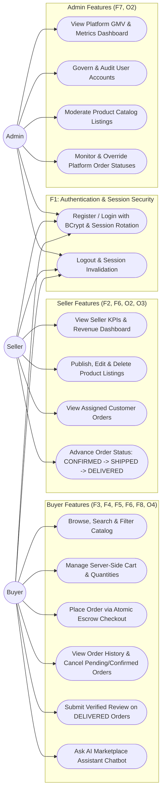

# D2: Use Case Diagram

Derived from Section 1 (Feature Requirements F1–F8) and Optional O2/O4 of the Capstone Project Requirements.

```mermaid
flowchart LR
    Buyer((Buyer))
    Seller((Seller))
    Admin((Admin))

    subgraph Authentication ["F1: Authentication & Session Security"]
        UC1([Register / Login with BCrypt & Session Rotation])
        UC2([Logout & Session Invalidation])
    end

    subgraph Buyer_Features ["Buyer Features (F3, F4, F5, F6, F8, O4)"]
        UC3([Browse, Search & Filter Catalog])
        UC4([Manage Server-Side Cart & Quantities])
        UC5([Place Order via Atomic Escrow Checkout])
        UC6([View Order History & Cancel Pending/Confirmed Orders])
        UC7([Submit Verified Review on DELIVERED Orders])
        UC8([Ask AI Marketplace Assistant Chatbot])
    end

    subgraph Seller_Features ["Seller Features (F2, F6, O2, O3)"]
        UC9([View Seller KPIs & Revenue Dashboard])
        UC10([Publish, Edit & Delete Product Listings])
        UC11([View Assigned Customer Orders])
        UC12([Advance Order Status: CONFIRMED -> SHIPPED -> DELIVERED])
    end

    subgraph Admin_Features ["Admin Features (F7, O2)"]
        UC13([View Platform GMV & Metrics Dashboard])
        UC14([Govern & Audit User Accounts])
        UC15([Moderate Product Catalog Listings])
        UC16([Monitor & Override Platform Order Statuses])
    end

    Buyer --> UC1
    Buyer --> UC2
    Buyer --> UC3
    Buyer --> UC4
    Buyer --> UC5
    Buyer --> UC6
    Buyer --> UC7
    Buyer --> UC8

    Seller --> UC1
    Seller --> UC2
    Seller --> UC9
    Seller --> UC10
    Seller --> UC11
    Seller --> UC12

    Admin --> UC1
    Admin --> UC2
    Admin --> UC13
    Admin --> UC14
    Admin --> UC15
    Admin --> UC16
```
