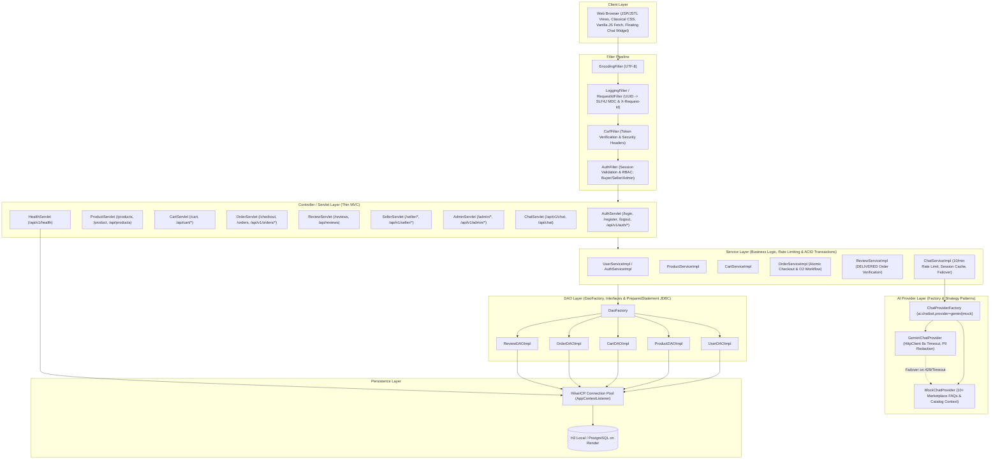

# D4: Architecture Diagram

Architecture layout of **MohanMart** showing the request lifecycle across Filter, Controller, Service, AI Provider, DAO, and Persistence layers.

```mermaid
flowchart TD
    subgraph Client_Layer ["Client Layer"]
        Browser["Web Browser (JSP/JSTL Views, Classical CSS, Vanilla JS Fetch, Floating Chat Widget)"]
    end

    subgraph Security_Filter_Pipeline ["Filter Pipeline"]
        F1["EncodingFilter (UTF-8)"]
        F2["LoggingFilter / RequestIdFilter (UUID -> SLF4J MDC & X-Request-Id)"]
        F3["CsrfFilter (Token Verification & Security Headers)"]
        F4["AuthFilter (Session Validation & RBAC: Buyer/Seller/Admin)"]
    end

    subgraph Controller_Layer ["Controller / Servlet Layer (Thin MVC)"]
        S_Auth["AuthServlet (/login, /register, /logout, /api/v1/auth/*)"]
        S_Prod["ProductServlet (/products, /product, /api/products)"]
        S_Cart["CartServlet (/cart, /api/cart/*)"]
        S_Order["OrderServlet (/checkout, /orders, /api/v1/orders/*)"]
        S_Review["ReviewServlet (/reviews, /api/reviews)"]
        S_Seller["SellerServlet (/seller/*, /api/v1/seller/*)"]
        S_Admin["AdminServlet (/admin/*, /api/v1/admin/*)"]
        S_Chat["ChatServlet (/api/v1/chat, /api/chat)"]
        S_Health["HealthServlet (/api/v1/health)"]
    end

    subgraph Service_Layer ["Service Layer (Business Logic, Rate Limiting & ACID Transactions)"]
        Svc_User["UserServiceImpl / AuthServiceImpl"]
        Svc_Prod["ProductServiceImpl"]
        Svc_Cart["CartServiceImpl"]
        Svc_Order["OrderServiceImpl (Atomic Checkout & O2 Workflow)"]
        Svc_Review["ReviewServiceImpl (DELIVERED Order Verification)"]
        Svc_Chat["ChatServiceImpl (10/min Rate Limit, Session Cache, Failover)"]
    end

    subgraph AI_Layer ["AI Provider Layer (Factory & Strategy Patterns)"]
        Factory_AI["ChatProviderFactory (ai.chatbot.provider=gemini|mock)"]
        Prov_Gemini["GeminiChatProvider (HttpClient 8s Timeout, PII Redaction)"]
        Prov_Mock["MockChatProvider (10+ Marketplace FAQs & Catalog Context)"]
    end

    subgraph DAO_Layer ["DAO Layer (DaoFactory, Interfaces & PreparedStatement JDBC)"]
        Factory_DAO["DaoFactory"]
        DAO_User["UserDAOImpl"]
        DAO_Prod["ProductDAOImpl"]
        DAO_Cart["CartDAOImpl"]
        DAO_Order["OrderDAOImpl"]
        DAO_Review["ReviewDAOImpl"]
    end

    subgraph Persistence_Layer ["Persistence Layer"]
        Pool["HikariCP Connection Pool (AppContextListener)"]
        DB[("H2 Local / PostgreSQL on Render")]
    end

    Browser --> F1
    F1 --> F2
    F2 --> F3
    F3 --> F4
    F4 --> Controller_Layer
    Controller_Layer --> Service_Layer
    Svc_Chat --> Factory_AI
    Factory_AI --> Prov_Gemini
    Factory_AI --> Prov_Mock
    Prov_Gemini -. "Failover on 429/Timeout" .-> Prov_Mock
    Service_Layer --> Factory_DAO
    Factory_DAO --> DAO_User & DAO_Prod & DAO_Cart & DAO_Order & DAO_Review
    DAO_User & DAO_Prod & DAO_Cart & DAO_Order & DAO_Review --> Pool
    S_Health --> Pool
    Pool --> DB
```
